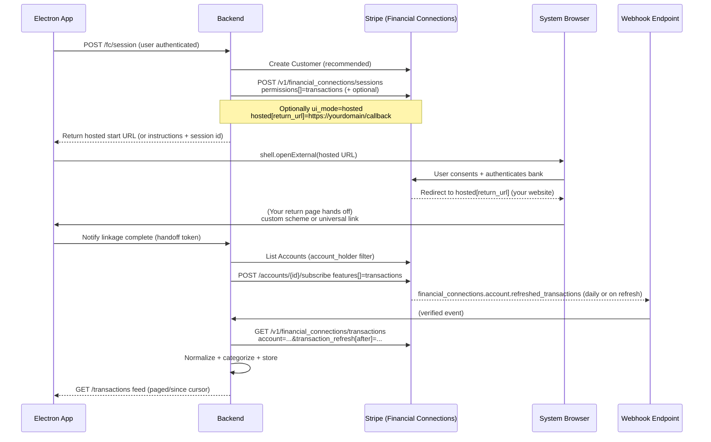
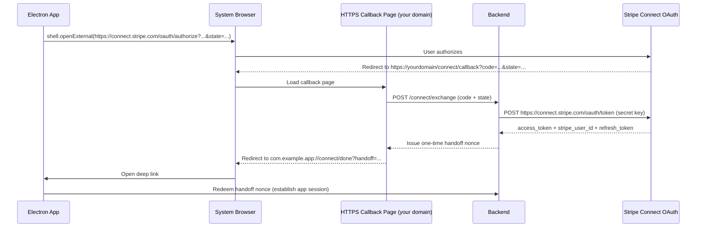

# Integrating Stripe Transaction Reading into an Electron macOS App with Secure External-Browser Redirects

## Executive Summary

Building a Rocket Money–style “read and categorize transactions” experience with Stripe in an Electron macOS desktop app is primarily a **Stripe Financial Connections** problem (user-permissioned access to bank account data), not a “payments acceptance” problem. Stripe Financial Connections provides a transactions API, a daily subscription mechanism to keep transactions fresh, and webhooks to notify you when refreshes complete. citeturn2view1turn20view1turn0search8turn1search0turn15view3

From a desktop-app security and UX perspective, the most robust approach is:

- **Always launch authentication/consent flows in the system browser** (not embedded webviews). This matches OAuth native-app best practice (external user-agent) and avoids “embedded webview” restrictions that some identity providers enforce. citeturn5search1turn0search30  
- **Use an HTTPS return page you control** (because Stripe Connect OAuth requires HTTPS redirect URIs in live mode, and Financial Connections hosted flows also use a web return URL). That return page then hands off to the Electron app via either **custom URL scheme**, **Universal Links**, or (for non-Stripe OAuth providers) a **loopback localhost** redirect. citeturn6view0turn9view0turn5search1  
- **Put all Stripe secret-key operations on a backend**: creating Financial Connections Sessions, subscribing to transaction refreshes, listing transactions, and verifying webhooks. citeturn9view0turn20view1turn0search8turn16view2  
- In Electron, use `shell.openExternal()` with strict URL allowlisting and deep-link handlers (`open-url` / `second-instance`) registered **early at startup**; store user/session tokens using `safeStorage` (Keychain-backed on macOS). citeturn2view4turn17view1turn14search3turn17view0

## Problem Framing and Transaction Models

### What “transactions” can mean in Stripe

Stripe exposes multiple “transaction-like” resources; choosing the right one depends on what you want to “read” and categorize:

- **Bank account transactions (Rocket Money–style)**: Use **Financial Connections Transactions**, which retrieve historical bank transactions on a linked Financial Connections Account, with user consent and explicit permissions. citeturn2view1turn0search8turn20view1  
- **Your Stripe account ledger activity**: Use **Balance Transactions** (`/v1/balance_transactions`), which represent funds moving through *your* Stripe balance (charges, refunds, payouts, etc.). This is useful for reconciliation views, not personal finance aggregation. citeturn7search0turn7search3  
- **Issued card transactions** (if you build products with Issuing): Issuing `Transaction` objects (`/v1/issuing/transactions`). citeturn7search1turn7search4  
- **Treasury money movement transactions** (if you use Treasury): Treasury `Transaction` objects (`/v1/treasury/transactions`). citeturn7search2turn7search5  

For a Rocket Money–like categorization UX, the relevant primary source is **Financial Connections Transactions**. Stripe explicitly positions transaction data for expense tracking and personal financial management–style use cases. citeturn2view1turn8search20

### Availability and expectations

Financial Connections availability can be constrained by geography and supported accounts; Stripe documents that Financial Connections is available to businesses in certain countries for use with US bank accounts. citeturn1search32  
Transaction history is also institution-dependent: the transactions list API returns a paginated list of up to the last **180 days** depending on the account’s financial institution. citeturn20view1

## Stripe APIs and Permissions for Reading Transactions

### Financial Connections: core API surface for “read transactions”

A rigorous “read and categorize transactions” integration generally uses:

**1) Create a Customer (recommended)**  
Stripe recommends creating a Customer with identifying info (email/phone) so you can later list previously linked accounts for that user. citeturn2view1

**2) Create a Financial Connections Session with the right permissions**  
You must request data permissions server-side when collecting accounts. The `permissions` array controls which data you can access; relevant values include `transactions` (and optionally `balances`, `ownership`). citeturn9view0turn9view2  
Creating a Session is done via `POST /v1/financial_connections/sessions`. citeturn8search3turn9view0

**3) Collect accounts via an authentication/consent flow**  
In the standard web pattern, the Session’s `client_secret` is used with Stripe.js to launch the flow; Stripe describes this as the secure way to launch the client-side modal. citeturn8search0turn18search8turn8search3  
For a desktop app that prefers *external browser* UX, Stripe documents a **hosted UI mode** (preview/beta): create a hosted Session by setting `ui_mode=hosted` and `hosted[return_url]`, and including a preview Stripe-Version header with `financial_connections_hosted_beta=v1`. citeturn9view0  
This hosted mode is particularly relevant to Electron because it avoids embedding a consent flow inside an app window while still following Stripe’s “return to a URL you control” pattern. citeturn9view0turn5search1

**4) List linked Financial Connections Accounts**  
Use `GET /v1/financial_connections/accounts` and filter by account holder (Customer or Account) or the Session. Stripe’s List Accounts endpoint allows filters such as `account_holder[customer]` or `session`. citeturn0search20turn20view1

**5) Subscribe to daily transaction refreshes (recommended for ongoing sync)**  
Stripe provides a subscription mechanism that automatically retrieves new transactions daily and notifies you when they’re available (via webhook). Subscribing is described as “the easiest way” to keep data up to date. citeturn20view0  
Endpoint pattern (server-side):  
`POST /v1/financial_connections/accounts/{ACCOUNT_ID}/subscribe` with `features[]=transactions`. citeturn20view0  
Unsubscribe uses `/unsubscribe` with the same `features[]` parameter. citeturn20view0

**6) Wait for refresh completion, then list transactions**  
Transaction refreshes are asynchronous; the account’s `transaction_refresh` field moves through `pending` and then `succeeded`/`failed`. citeturn20view0  
Stripe sends `financial_connections.account.refreshed_transactions` when a refresh completes; webhook handlers should check `transaction_refresh.status`. citeturn20view0turn15view3  

Then retrieve transactions via the list API:  
`GET /v1/financial_connections/transactions` with required `account` parameter. citeturn0search8turn20view1  

**Incremental sync**: pass `transaction_refresh[after]=...` to fetch only transactions new/updated since the last observed refresh identifier. citeturn20view2  

### Webhooks needed for a production “transaction sync” loop

At minimum for Financial Connections transaction syncing, plan around:

- `financial_connections.account.created` (account linked) citeturn15view3turn9view0  
- `financial_connections.account.refreshed_transactions` (daily or on-demand refresh completed) citeturn20view0turn15view3  
- Optionally: refreshed balances/ownership if you request those permissions. citeturn15view3turn9view2  

Stripe’s general webhook docs emphasize: register an HTTPS endpoint, verify signatures using `Stripe-Signature`, and retain the raw request body for verification. citeturn15view0turn16view2

### Stripe Connect OAuth and scopes in this context

If you also need to connect a user’s Stripe account (e.g., your desktop app is a “platform” connecting merchants), Stripe Connect OAuth uses:

- Authorization endpoint: `GET https://connect.stripe.com/oauth/authorize` citeturn6view0  
- Token endpoint: `POST https://connect.stripe.com/oauth/token` using your secret API key (server-side) citeturn2view0  
- Deauthorize endpoint: `POST https://connect.stripe.com/oauth/deauthorize` citeturn2view0  
- `scope` values: `read_write` or `read_only` (default read_only), depending on access needed. citeturn2view0turn6view0  
- CSRF protection: Stripe supports a `state` parameter on the authorize request. citeturn6view0turn5search3  

Critical desktop-specific nuance: Stripe’s Connect OAuth reference states that in live mode the `redirect_uri` must use secure **HTTPS**. That usually means you **cannot** use a custom scheme or loopback URI as the Stripe redirect target; instead, use an HTTPS callback you control and then hand off to the desktop app. citeturn6view0  
Also, Stripe notes OAuth isn’t recommended for new Connect platforms and points to Connect Onboarding alternatives for Standard accounts. citeturn2view0

## Desktop Auth Patterns and Redirect Options

### Recommended flow shape for Electron desktop apps

For desktop apps, modern best practice is:

- Use the **system browser** as the “external user-agent” for auth/consent, not an embedded webview. citeturn5search1turn0search30  
- Use **Authorization Code + PKCE** when the identity provider supports it, to mitigate authorization-code interception attacks for public clients. citeturn5search2turn5search1  
- Always include and validate an unguessable **state** value to protect against CSRF and request swapping. citeturn5search3turn6view0  

Stripe Connect OAuth documentation lists supported parameters and does not document PKCE parameters (for example `code_challenge`). Practically, for Connect OAuth you should assume the code exchange must happen on your backend (confidential client) because it requires your secret API key at the token endpoint. citeturn2view0turn6view0

For Financial Connections, the “authorization” concept is expressed as **data permissions** (`permissions[]=transactions`, etc.) on server-side objects and a consent flow; you still want the system browser for the UX and security properties. citeturn9view0turn2view1turn5search1

### Redirect methods comparison for macOS Electron

| Redirect method | Best fit | Pros | Cons / risks | High-level implementation steps (macOS Electron) |
|---|---|---|---|---|
| Custom URL scheme (e.g., `com.example.app://oauth/callback`) | When you can’t rely on Universal Links, or want the simplest deep-linking | Straightforward; works offline; doesn’t require domain ownership | Scheme hijacking risk (another app can register same scheme); requires packaging on macOS for reliable protocol handling; must harden parsing/CSRF | 1) Add scheme in app bundle `Info.plist` (`CFBundleURLTypes` / `CFBundleURLSchemes`). citeturn4search7turn13view0turn14search3 2) Package app; protocol handling works only when packaged on macOS/Linux per Electron deep-link docs. citeturn13view0 3) Register handlers early: `app.on('open-url', ...)` and use `app.requestSingleInstanceLock()` patterns. citeturn14search3turn13view1 |
| Universal Links (HTTPS + Associated Domains) | High-security deep linking on macOS 10.15+ where you own a domain and can sign with entitlements | Uses standard HTTPS links; Apple notes they can’t be claimed by other apps and are secured by an association file on your server; graceful fallback to website if app not installed citeturn3view7 | More operational complexity (domain + hosted association file + entitlements + signing/notarization); Electron support path is less “turnkey” than native apps; community reports of Electron universal-link delivery edge cases on cold launch—requires thorough version testing citeturn14search0turn14search3turn3view7 | 1) Host `apple-app-site-association` file at `https://<domain>/.well-known/...` or root; no redirects. citeturn3view7 2) Add associated domains entitlement `com.apple.developer.associated-domains` with `applinks:<domain>`. citeturn3view7 3) In Electron, handle `continue-activity` and inspect `details.webpageURL` (maps to NSUserActivity browsing web). citeturn14search3turn14search6 |
| Loopback localhost (e.g., `http://127.0.0.1:<port>/callback`) | Best-practice OAuth redirect for native apps **when the OAuth provider allows it** | Strong native-app OAuth alignment; avoids scheme hijacking; app can bind a random ephemeral port; recommended in OAuth native-app BCP citeturn5search1 | Not always allowed by providers; may conflict with providers that require HTTPS redirect URIs (Stripe Connect live-mode redirect requires HTTPS); some enterprise environments restrict localhost callbacks citeturn6view0turn5search1 | 1) Start a local HTTP listener on `127.0.0.1` on a random port. citeturn5search1 2) Use `shell.openExternal()` to launch auth URL in browser with redirect_uri to that listener. citeturn17view1turn5search1 3) Receive code on localhost, validate state/PKCE, then exchange code in backend. citeturn5search2turn5search3 |

### Practical recommendation specific to Stripe + desktop

Because Stripe Connect OAuth requires HTTPS redirect URIs in live mode and Financial Connections hosted mode is framed around returning to a URL, a pragmatic pattern is:

1) Stripe redirects to **your HTTPS callback page** (web). citeturn6view0turn9view0  
2) That page immediately hands off to the desktop app (custom scheme or Universal Link), ideally carrying only a **one-time handoff token** (not the Stripe code itself). (This is a security architecture recommendation; the Stripe-side requirement for HTTPS is documented, while the “handoff token” is a best practice to reduce leakage of sensitive parameters.) citeturn6view0turn5search1turn5search2  

## Electron macOS Implementation Guidance and Code Patterns

### Opening the external browser safely

Electron’s `shell.openExternal()` launches the user’s default handler for a URL. It supports an `activate` option on macOS and returns a Promise. citeturn17view1  
Electron’s security guidance explicitly warns not to pass untrusted content to `openExternal`, because improper use can be leveraged to compromise the user’s host. citeturn2view4turn10search28

**Recommended pattern: strict allowlist + protocol checks**

```js
// main/auth/openExternal.js
const { shell } = require('electron');

const ALLOWED_HOSTS = new Set([
  'connect.stripe.com',
  'api.stripe.com',
  'dashboard.stripe.com',
  'yourdomain.example', // your hosted callback domain
]);

function assertSafeExternalUrl(raw) {
  const u = new URL(raw);

  // Only allow https for browser launch (avoid file:, javascript:, etc.)
  if (u.protocol !== 'https:') throw new Error('Blocked non-https external URL');

  // Host allowlist
  if (!ALLOWED_HOSTS.has(u.host)) throw new Error(`Blocked external host ${u.host}`);

  return u.toString();
}

async function openExternalSafe(rawUrl) {
  const safe = assertSafeExternalUrl(rawUrl);
  // activate:true brings browser to foreground on macOS (default true)
  await shell.openExternal(safe, { activate: true });
}

module.exports = { openExternalSafe };
```

This alignment (https-only, allowlisted hosts) is a concrete mitigation against the `openExternal` attack surface described in Electron’s official security guidance. citeturn2view4turn17view1

### Handling custom URL scheme redirects on macOS

Electron’s `open-url` event is the primary hook on macOS for custom protocol events. The docs note:

- Your `Info.plist` must define the URL scheme in `CFBundleURLTypes` and set `NSPrincipalClass` to `AtomApplication`. citeturn14search3  
- Register the listener **early** in startup (not only after `ready`) or you can miss launch URLs. citeturn14search3  

Electron also documents that protocol handling on macOS behaves differently than Windows/Linux (which tend to use `second-instance`), and that deep links only work when the app is packaged on macOS/Linux. citeturn13view0turn13view1

**Main-process skeleton (macOS custom scheme + single instance)**

```js
// main.js
const { app, BrowserWindow } = require('electron');

let mainWindow;

function parseDeepLink(urlStr) {
  const u = new URL(urlStr);
  // Example: com.example.app://oauth/callback?handoff=abc&state=xyz
  return {
    path: u.pathname,
    handoff: u.searchParams.get('handoff'),
    state: u.searchParams.get('state'),
  };
}

// Must be registered early on macOS
app.on('open-url', (event, urlStr) => {
  event.preventDefault();
  const payload = parseDeepLink(urlStr);

  // TODO: validate payload.state matches state in memory / in secure storage
  // TODO: redeem payload.handoff with backend
  if (mainWindow) mainWindow.webContents.send('auth:callback', payload);
});

const gotLock = app.requestSingleInstanceLock();
if (!gotLock) {
  app.quit();
} else {
  app.on('second-instance', (event, argv) => {
    // On Windows/Linux, argv may contain the deep link; macOS uses open-url
    const deepLinkArg = argv.find(a => a.startsWith('com.example.app://'));
    if (deepLinkArg) {
      const payload = parseDeepLink(deepLinkArg);
      if (mainWindow) mainWindow.webContents.send('auth:callback', payload);
    }
    if (mainWindow) {
      if (mainWindow.isMinimized()) mainWindow.restore();
      mainWindow.focus();
    }
  });

  app.whenReady().then(() => {
    mainWindow = new BrowserWindow({
      webPreferences: {
        // Prefer hardened defaults
        contextIsolation: true,
        nodeIntegration: false,
        sandbox: true,
        // preload: path.join(__dirname, 'preload.js'),
      },
    });

    mainWindow.loadURL('file://' + __dirname + '/index.html');
  });
}
```

Electron documents both the need to register `open-url` early and the macOS packaging constraint for protocol handling. citeturn14search3turn13view0  
Electron also documents `contextIsolation` and warns about `<webview>` risks; `contextIsolation` is the isolation layer that makes preload/Electron APIs inaccessible to untrusted content. citeturn10search1turn10search4

### Universal Links in Electron: feasibility notes

Electron exposes a `continue-activity` event on macOS with an optional `details.webpageURL`, which is the key field you’d use when macOS opens the app from a universal link (NSUserActivity browsing web). citeturn14search3turn14search6  
However, recent Electron issue reports describe universal-link delivery edge cases on cold launch in some versions (URL may be dropped). That doesn’t make Universal Links unusable, but it does mean you should test your targeted Electron version(s) and maintain a fallback. citeturn14search0

### Secure local token storage in Electron

Electron `safeStorage` encrypts/decrypts strings using OS-provided cryptography; on macOS, encryption keys are stored in Keychain Access in a way that prevents other applications from loading them without user override. citeturn17view0  

A pragmatic pattern is “encrypt then store ciphertext in your app data directory.” Store **your own app’s session tokens** (e.g., JWT to your backend, refresh token to your backend), not Stripe secret keys.

```js
// main/secureStore.js
const { app, safeStorage } = require('electron');
const fs = require('node:fs');
const path = require('node:path');

const TOKEN_PATH = () => path.join(app.getPath('userData'), 'tokens.blob');

function saveTokens(tokensObj) {
  const plaintext = JSON.stringify(tokensObj);
  const encrypted = safeStorage.encryptString(plaintext); // Buffer
  fs.writeFileSync(TOKEN_PATH(), encrypted);
}

function loadTokens() {
  if (!fs.existsSync(TOKEN_PATH())) return null;
  const encrypted = fs.readFileSync(TOKEN_PATH());
  const plaintext = safeStorage.decryptString(encrypted);
  return JSON.parse(plaintext);
}

module.exports = { saveTokens, loadTokens };
```

This approach directly leverages Electron’s documented Keychain-backed semantics on macOS. citeturn17view0

### Loopback + PKCE example for non-Stripe OAuth providers

Even though Stripe Connect OAuth requires HTTPS redirect URIs in live mode (making loopback inapplicable to that Stripe flow), loopback+PKCE is still useful for authenticating the user to *your own* system (or a third-party IdP) in a native desktop app, and is explicitly addressed in RFC 8252 and RFC 7636. citeturn6view0turn5search1turn5search2

```js
// main/oauthLoopbackPkce.js
const http = require('node:http');
const crypto = require('node:crypto');
const { shell } = require('electron');

function base64url(buf) {
  return buf.toString('base64').replace(/\+/g, '-').replace(/\//g, '_').replace(/=+$/, '');
}

async function startLoopbackPkceAuth({ authorizeUrlBase, clientId, scopes }) {
  // PKCE code verifier/challenge (RFC 7636)
  const codeVerifier = base64url(crypto.randomBytes(32));
  const codeChallenge = base64url(crypto.createHash('sha256').update(codeVerifier).digest());

  // CSRF state (RFC 6749)
  const state = base64url(crypto.randomBytes(16));

  const server = http.createServer();
  const port = await new Promise(resolve => server.listen(0, '127.0.0.1', () => resolve(server.address().port)));
  const redirectUri = `http://127.0.0.1:${port}/callback`;

  const authUrl = new URL(authorizeUrlBase);
  authUrl.searchParams.set('response_type', 'code');
  authUrl.searchParams.set('client_id', clientId);
  authUrl.searchParams.set('redirect_uri', redirectUri);
  authUrl.searchParams.set('scope', scopes.join(' '));
  authUrl.searchParams.set('state', state);
  authUrl.searchParams.set('code_challenge', codeChallenge);
  authUrl.searchParams.set('code_challenge_method', 'S256');

  const resultPromise = new Promise((resolve, reject) => {
    server.on('request', (req, res) => {
      try {
        const u = new URL(req.url, redirectUri);
        if (u.pathname !== '/callback') return;

        const returnedState = u.searchParams.get('state');
        const code = u.searchParams.get('code');
        if (!code || returnedState !== state) throw new Error('State mismatch');

        res.writeHead(200, { 'Content-Type': 'text/html' });
        res.end('<html><body>Authenticated. You may close this window.</body></html>');

        resolve({ code, codeVerifier, redirectUri });
        server.close();
      } catch (e) {
        reject(e);
        server.close();
      }
    });
  });

  await shell.openExternal(authUrl.toString());
  return resultPromise; // Exchange code on backend; do not embed client secrets in the app
}
```

This implements the recommended “external user-agent” flow and PKCE’s protection against code interception. citeturn5search1turn5search2turn5search3turn17view1

## Security and Compliance Considerations

### Keep Stripe secrets and privileged calls off the desktop

Stripe Connect OAuth token exchange is explicitly shown using a secret API key at the token endpoint; implementing this directly in a desktop app would expose sensitive credentials. citeturn2view0  
Similarly, Financial Connections account listing, subscribing, and transaction listing are server-side API calls authenticated with your secret key. citeturn20view0turn0search8turn0search20  

Design implication: Electron should authenticate to **your backend**, and your backend should authenticate to Stripe.

### Protect client-side “secrets” created for linking flows

Stripe warns that a Financial Connections Session `client_secret` allows client-side SDKs to make changes and should not be stored, logged, embedded in URLs, or exposed beyond the end user, and that pages including it should use TLS. citeturn9view3  
Even if you use hosted mode and avoid directly exposing `client_secret` to the desktop, apply the same operational hygiene to any session-like tokens you pass between app and backend.

### Webhook security fundamentals

Stripe documents signature verification using `Stripe-Signature`, including HMAC-SHA256 signature schemes and replay-attack protections via timestamps. citeturn16view2  
For Financial Connections transaction syncing, your webhook endpoint becomes the “source of truth” trigger for incremental transaction fetch using `transaction_refresh[after]`. citeturn20view2

### Avoid embedded webviews for auth flows

OAuth for native apps is best practice to use external user-agents (system browser). citeturn5search1  
Separately, large identity ecosystems have explicitly prohibited OAuth in embedded webviews (example: Google’s policy announcement), which is a practical reason desktop apps often prefer the system browser. citeturn0search30

### Electron-specific hardening

Electron’s official security guidance highlights risks in loading arbitrary remote content, and specifically warns against using `shell.openExternal` with untrusted content. citeturn10search4turn2view4  
Electron’s WebPreferences docs highlight `contextIsolation` and `<webview>` considerations; the secure default stance for a financial-data app is to keep Node.js out of renderer pages and expose a minimal, well-validated IPC API from preload. citeturn10search1turn10search4

## Reference Architecture and Diagrams

### Architecture overview

A production-grade architecture typically looks like this:

- **Electron app**: UI, local cache, category rules, and user-facing flows; opens external browser; handles deep links/hand-offs; stores only *app* auth tokens (Keychain-backed).
- **Backend**: owns Stripe secret keys; creates Financial Connections Sessions; stores linked accounts; subscribes/unsubscribes and syncs transactions; runs webhook endpoint; provides normalized transaction feed to the desktop app.
- **Stripe**: Financial Connections + transactions APIs + webhook event delivery.

```mermaid
flowchart LR
  subgraph Desktop[Electron macOS App]
    UI[UI: Accounts + Categories]
    DL[Deep link handler\n(custom scheme or universal link)]
    Store[Secure local store\n(Electron safeStorage)]
  end

  subgraph Backend[Your Backend]
    API[App API]
    DB[(DB: users, accounts,\ntransactions, categories)]
    WH[Webhook endpoint\n(signature verified)]
    Sync[Sync workers\n(refresh + list txns)]
  end

  subgraph StripeSide[Stripe]
    FC[Financial Connections\nSessions / Accounts / Transactions]
    Events[Webhook events]
  end

  UI -->|HTTPS (app auth)| API
  API --> DB
  API -->|Secret-key calls| FC
  Events -->|HTTPS webhook| WH --> Sync -->|list/subscribe/unsubscribe| FC
  Sync --> DB
  DL --> UI
  Store --> UI
```

This separation is directly motivated by Stripe’s documented server-side requirements (secret key usage, subscribe/list endpoints) and Stripe’s webhook model. citeturn2view0turn20view0turn15view0turn16view2

### Primary sequence: Financial Connections hosted linking + transaction sync



Key sequence details are grounded in Stripe’s documented hosted session parameters and return URL, subscription endpoint, refreshed-transactions webhook event, and incremental list API filter. citeturn9view0turn20view0turn20view2turn15view3turn16view2

### Secondary sequence: Connect OAuth handshake adapted for desktop

Because Connect OAuth requires HTTPS redirect URIs in live mode, the usual pattern is **web callback → desktop handoff**:



This directly follows Stripe’s documented authorize endpoint, `state` usage, and server-side token exchange using your secret API key. citeturn6view0turn2view0turn5search3

## Prioritized Source Index

### Stripe primary documentation

Financial Connections transactions (subscribe, webhooks, list, incremental sync, 180-day note). citeturn20view1turn20view2turn20view0  
Financial Connections Sessions (create + permissions). citeturn8search3turn9view0turn9view2  
Hosted Session mode for data-powered products (preview header + `ui_mode=hosted` + `hosted[return_url]`). citeturn9view0  
List Accounts and List Transactions API references. citeturn0search20turn0search8  
Financial Connections webhooks overview + event types list. citeturn1search0turn15view3  
General Stripe webhooks security and signature verification guidance. citeturn15view0turn16view2  
Connect OAuth reference + Standard accounts OAuth guide (scope/state, HTTPS redirect requirement, token/deauthorize endpoints). citeturn6view0turn2view0  
Balance Transactions API reference (if you also need Stripe-ledger “transactions”). citeturn7search0turn7search3  

### Electron primary documentation

`shell.openExternal()` API and options. citeturn17view1  
Electron security guidance warning against `openExternal` with untrusted content. citeturn2view4  
Deep linking tutorial (macOS packaging constraint, open-url vs second-instance, plist example). citeturn13view0turn13view1  
`app` events: `open-url` (Info.plist requirements, register early), `continue-activity` (`webpageURL`). citeturn14search3  
`safeStorage` (Keychain-backed keys on macOS). citeturn17view0  
WebPreferences security-relevant fields (`contextIsolation`, `<webview>` considerations). citeturn10search1  

### Apple documentation and standards

Apple Universal Links concepts and mechanics (association file, entitlements, security properties such as “can’t be claimed by other apps”). citeturn3view7  
Launch Services explanation of URL scheme declarations (`CFBundleURLSchemes`, `CFBundleURLName`, `CFBundleURLTypes`). citeturn4search7  
`NSUserActivityTypeBrowsingWeb` reference (universal link / browsing web activity context). citeturn14search6  
OAuth 2.0 for Native Apps (external user-agent; native redirect patterns). citeturn5search1  
PKCE (authorization code interception mitigation). citeturn5search2  
OAuth 2.0 core (state parameter and framework). citeturn5search3  

### Selected practical references and caveats

Example of embedded-webview restrictions (Google blocks OAuth in embedded webviews)—useful context for “why external browser.” citeturn0search30  
Universal Links in Electron can have edge cases on cold launch (test target Electron versions thoroughly). citeturn14search0